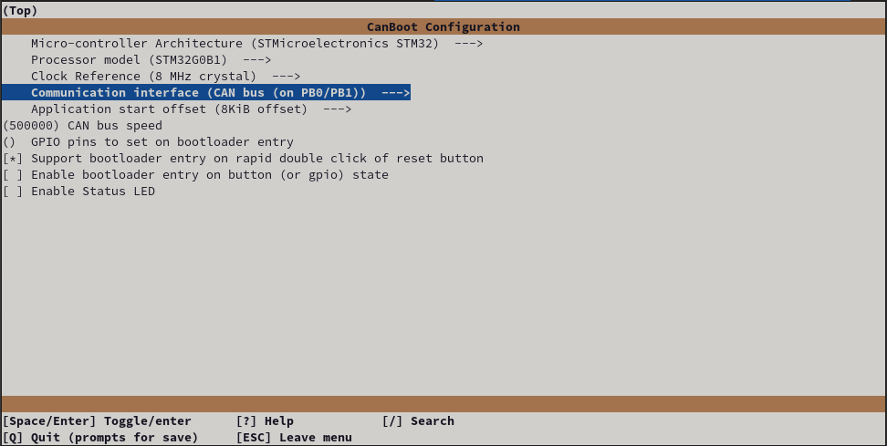
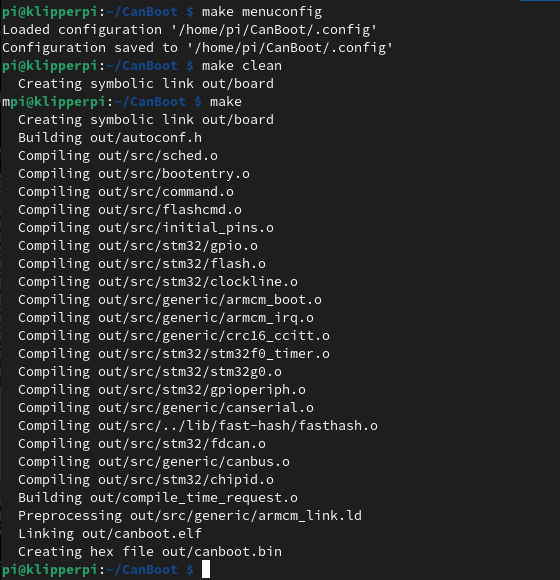
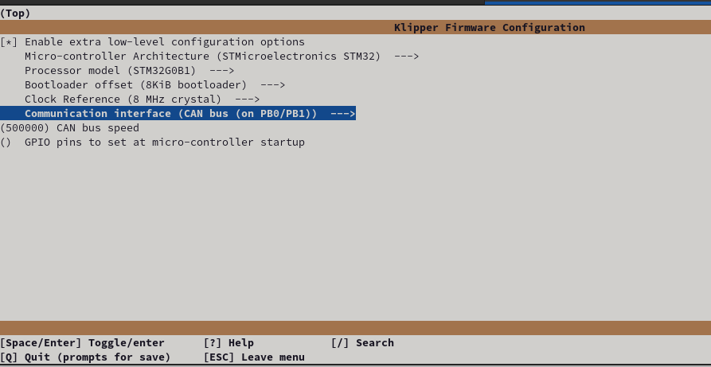

# BIGTREETECH EBB36/42 v1.1 (STM32G0B1)

**Important notes about this board.**

## **THE BOOT PIN IS PULLED HIGH DURING DFU MODE THIS PIN IS SHARED WITH THE HEATER AND WILL CAUSE YOUR HEATER TO HEAT - REMOVE 24V POWER WHEN ENTERING DFU MODE**


The probe port only supplies **5v** so may not work with certain **inductive** probes.

- **Pinda / BlTouch style probes will work fine**

# Flashing the canboot firmware via DFU on EBB36/42 (ST32G0B1)

# **Before proceeding it is critical that your CAN network is configured for your printer, failure to setup the network will cause a problem when you try to connect devices :) click [here](../index.md#control-boards) and select your controller for setup instructions!**


## **Generate the CANboot firmware file**

1. clone the CanBoot repository to your pi
   
    >```bash
    >cd ~/
    >git clone https://github.com/Arksine/CanBoot
    >```

2. run the following

    >```bash
    >cd CanBoot
    >make menuconfig
    >```

5. Configure your makefile for the **EBB 36 / 42 v1.1/v1.2 with STM32G0B1**
   
    

    
    Exit using <kbd>ESC</kbd> or <kbd>Q</kbd>, confirm with yes(<kbd>Y</kbd>)

6. Build the firmware
    >```bash
    >make clean
    >
    >make
    >```

    


## **Hook up the Board for flashing**

1. Add the 5v jumper to the pins highlighted below


    [](../images/ebb36_v1.1_reset.png) [](../images/ebb42_v1.1_reset.png)


2. Connect your device to your PI via USB 

3. Hold the RESET button and BOOT shown above
    - Release Reset
    - Release Boot

4. Verify the device is in bootloader moad by using `lsusb -l`
   - you should see something like 
   >```bash 
   >    Bus 001 Device 005: ID 0483:df11 STMicroelectronics STM Device in DFU Mode
   >```

5. Flash the canboot bootloader to the board **YOUR DeviceID (0483:df11) may be different CHECK IT!** *(see step 2)*

6. ERASE AND FLASH THE CANBOOT FIRMWARE
   
   >```bash 
   >sudo dfu-util -a 0 -D ~/CanBoot/out/canboot.bin --dfuse-address 0x08000000:force:mass-erase:leave -d 0483:df11
   >```

    

7.  Power off the Board, and insert the CANBUS cable

-----

** if you havent setup your network yet, NOW is your last chance before it becomes a problem, click [here](../index.md#control-boards), and select your control board for instrutions, then return here and carry on :)**


-----


8. You can now power up your printer with the toolhead board attached via the appropriate wiring scheme using the H L 24v and gnd wires.  

9. Wait for the device to boot and ensure your CAN0 network is up and you can see the device 
    
    >```bash
    >~/klippy-env/bin/python ~/klipper/scripts/canbus_query.py can0
    >```

    or

    >```bash
    >~/CanBoot/scripts/flash_can.py -i can0 -q
    >```

    You should see something like 

    >```bash
    >"Found canbus_uuid=XXXXXXXXXX, Application: CanBoot"
    >```


10. Assuming the above gave you a UUID you can now flash Klipper to your board via CanBoot... (if not see the troubleshooting section [here](../troubleshooting.md))

    >```bash 
    >cd ~/klipper
    >make menuconfig
    >```

    >Enable low level configuratation
    >set the following.

    

    Hit <kbd>Q</kbd> to exit and select <kbd>Y</kbd> to save changes.

    >```bash
    >make clean
    >make
    >```

    **You can now flash the board**

    >```
    >python3 ~/CanBoot/scripts/flash_can.py -i can0 -f ~/klipper/out/klipper.bin -u MYUUID
    >```

    


    If all is well you now have a klipper firmware on your SHT.

    To verify this you can query the canbus uuid with 

    >```bash
    >~/klippy-env/bin/python ~/klipper/scripts/canbus_query.py can0
    >```

    You should see something like 

    >```bash
    >"Found canbus_uuid=XXXXXXXXXX, Application: Klipper"
    >```

    

## Need a config 
1.1 [here you go](./example_configs/toolhead_btt_ebbcan_G0B1_v1.1.cfg)
1.2 [here you go](./example_configs/toolhead_btt_ebbcan_G0B1_v1.2.cfg)

Enjoy!


### [Return to Main](../index.md)


<WIP>

