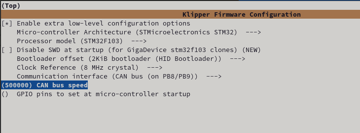
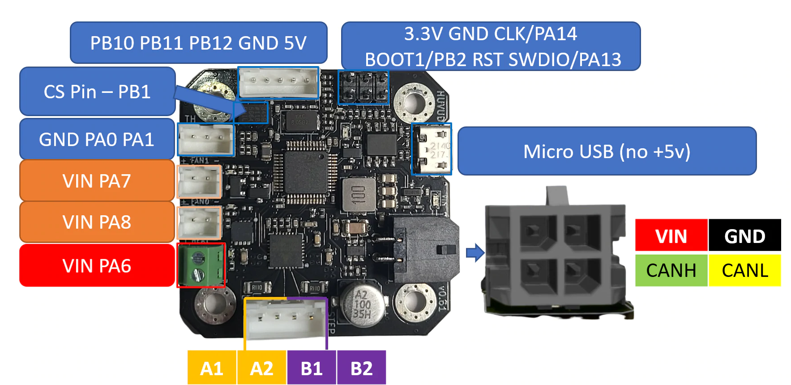

# Huvud Firmware

The boards should come preloaded with the HID bootloader for flashing over USB.

This firmware allows them to be flashed via USB however **they require a 12/24v** to be supplied while flashing, as the USB connector is not designed to supply power!

If this firmware is missing an STLINK is needed to perform a bootloader 

A CAN capable bootloader is also avaliable but requires use of an STLinkv2 device and software from STMicro.

> **NOTE: DO NOT SUPPLY EXTERNAL VOLTAGE WHEN FLASHING USING AN STLINKv2**

*More information about flashing using an STLinkv2 can be found following the links to eddietheengineers videos after the HID Flashing section below.*


# **Before proceeding it is critical that your CAN network is configured for your printer, failure to setup the network will cause a problem when you try to connect devices :) click [here](../index.md#control-boards) and select your controller for setup instructions!**

## HID Flashing

This section is specific to flashing using the HID bootloader skip to [here](#stlink-flashing) for stlink flashing.

### Wiring (Flashing via HID)

For flashing Wire the boards up like so


### Building HID Firmware

The following settings apply only to the HID firmware, please follow Eddies video for  Canboot compatible settings (i.e. bootloader offsets)

>!!!! Enable extra config options!!!!
>- Enable Micro-controller Architecture (STMicroelectronics STM32)
>- Select STM32F103 as the Processor Model
>- Select 2KiB bootloader (HID Bootloader) as the Bootloader offset
>- Clock Reference 8mhz (*[according to the spec sheet](https://github.com/bondus/KlipperToolboard/blob/master/PCB/HuvudTiny2/huvud061_schematics.pdf)*)
>- Set your CAN bus rate (250k or 500k are common)
>!!!! Pick CAN pins (Pins PB8(rx) and PB9(tx)) !!!!

Press <kbd>Q</kbd> to exit and <kbd>Y</kbd> to save the firmware configuration.

Now you can build the firmware file using

```bash
make clean

make
```





### Flashing


To enter the bootloader pin BOOT1 must be connected to  3.3V when the board is powered up or reset. When in the bootloader the  green LED will flash quickly. 

Flash with the following command
```bash
make flash  FLASH_DEVICE=1209:beba
```


## STLink Flashing 

> **NOTE: DO NOT SUPPLY EXTERNAL VOLTAGE WHEN FLASHING USING AN STLINKv2**

## Flashing via STLink v2 / Installing CanBoot


> **NOTE: DO NOT SUPPLY EXTERNAL VOLTAGE WHEN FLASHING USING AN STLINKv2**

[eddietheengineer](https://github.com/eddietheengineer) has an excellent guide on flashing the CANBoot firmware.

[](https://www.youtube.com/watch?v=YrF99Sff9g8 "Flashing Klipper Firmware over CANBUS")


Reference images can also be found in the [below the video.](#stlink-pinout-reference) 


## STLINK PINOUT REFERENCE

### HUVUD
[]()


## Huvud Pinout




## Example firmware

Example configuration files for the 0.61 Huvud can be found [here](./example_configs/toolhead_bondus_huvud_0_61.cfg).


### [Return to Main](../index.md)